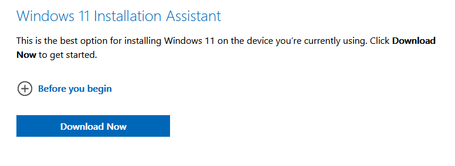
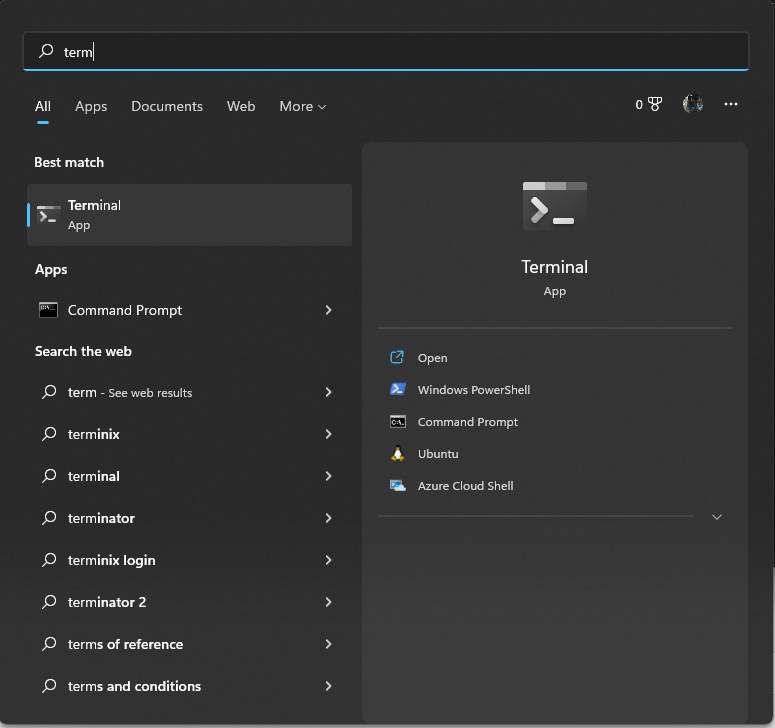
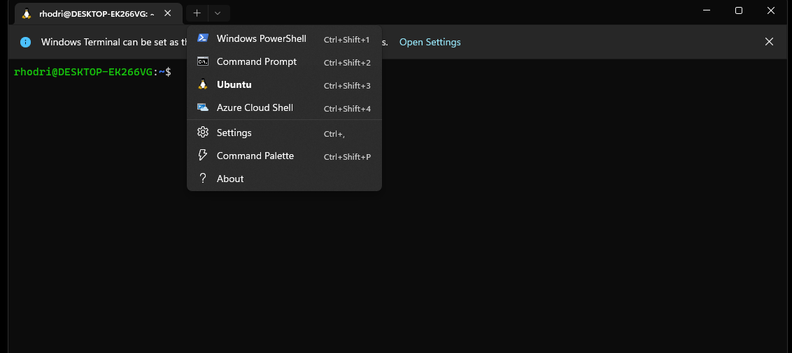
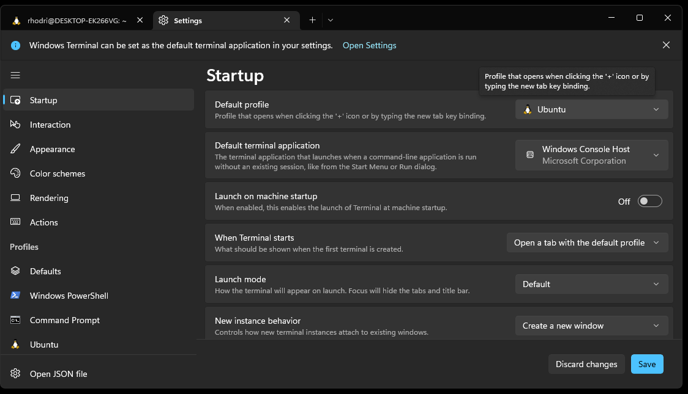

# Windows 11 setup instructions

These instructions assume you are installing software on a 2022 16GB Dell Latitude 5320 laptop (as supplied by the department). However, the instructions should largely be similar on other Windows 11 machines. Note that if you're using a Windows 10 machine, the WSL installation process will vary slightly.

**Important:** Whilst the below instructions contain a reasonable amount of detail, they are not all-encompassing. If anything is unclear please ask for assistance.

### Initial boot up

Upon initial boot you will be guided through the Windows 10 setup process. Select your language, region and keyboard. During this process you will be asked to connect to a wifi network. If you are in college, then you can connect to the "Imperial-WPA" network using your college username, which has been sent to you (it will look something like abc22 or ab622), and your college password. You'll be asked to agree to the Windows 10 Licence Agreement.

You should now see a screen asking "How would you like to set up?". Either option (Personal/Organization) is fine.
<span style="color:red">Note however that if you choose to link your machine to your Imperial (Microsoft) account during the setup, if you are asked whether to "Allow My Organization To Manage My Device". Make sure this option is NOT selected."</span>. (If this is selected you may loose some root privileges and not be able to complete the setup as required!)

### Selecting Organisation

Select "Set up for an organization". Proceed to sign on with your college email, e.g. "abc22@ic.ac.uk".

Now you will asked to set the "Services". Select your choices and you should arrive at "Preferences". Type your details. You will be asked to agree to "Dell's privacy and telemetry notice".

You'll arrive at a screen with the heading "Use Windows Hello with your account". Select OK and verify your identity using a Microsoft authentication method. Next setup a PIN.

You should now be in Windows 10. 

To upgrade to Windows 11, open the Edge browser and navigate to https://www.microsoft.com/en-us/software-download/windows11 and click on the Download link for "Windows 11 Installation Assistant".   
   
Install the application and follow the instructions. It will force you to download another application that will perform a "health check" before you can proceed to download Windows 11.

### Selecting Personal or an offline account

If you have selected "Set up for personal use", you can then either use a Microsoft account to sign in or you can do an offline installation. If you are asked during the installation whether you would like to upgrade to Windows 11, select yes. Proceed through the instructions until you are are in Windows 10.

You can check if Windows 11 is downloading by check notifications and/or going to `Start` > `Settings` > `Update & Security` > `Windows Update`. If Windows 11 is not in the process of being downloaded then upgrade to Windows 11 by opening the Edge browser and navigating to https://www.microsoft.com/en-us/software-download/windows11 Click on the Download link for "Windows 11 Installation Assistant".   
   
Install the application and follow the instructions. It will force you to download another application that will perform a "health check" before you can proceed to download Windows 11.

For other methods of installing/upgrading to Windows 11, see [here](https://support.microsoft.com/en-us/windows/ways-to-install-windows-11-e0edbbfb-cfc5-4011-868b-2ce77ac7c70e).

<span style="color:red"> Only proceed past this point if your laptop is running Windows 11</span>

Once the Windows 11 update and setup is complete. You should first ensure your computer is up to date, and if necessary, install all available updates. To do this, go to `Start` > `Settings` > `Update & Security` > `Windows Update`  and select `Check for updates`. Install any available updates.

Many drivers will most likely need to be updated. You will prompted to restart the computer on several occasions for these updates to proceed.

Next, Dell system updates should be installed. To do this, click `Start` and then search for and open the `Dell Command | Update`. Once open, `CHECK` for updates and install any available.

**NOTE:** The above steps will take in the region of 90 (maybe more) minutes.

When complete, before moving on you may wish to install the MS Teams app. Ensure you're able to login using your Imperial College credentials.

Once your computer is up-to-date, you're ready to proceed to the main set-up instructions.

### WSL (Windows Subsystem for Linux) version 2 installation

If installing on a departmental provided machine (or a WSL2 ready Windows 11 machine) you can follow the instructions below. Otherwise, please see Microsoft's instructions for installing WSL [here](https://learn.microsoft.com/en-us/windows/wsl/install).

First open a `Windows PowerShell` terminal with administrator privileges (locate the app, right click and then select `Run as Administrator`). In the opened terminal type
```
wsl --install
```
If the installation has been successful, you now need to reboot the system.
This will, by default, install Ubuntu on your machine, which is what we want. To check all is so far so good, in the terminal type
```
wsl -l -v
```
You should see an output along the lines of
```
 NAME      STATE           VERSION
*Ubuntu    Stopped         2
```
You will now have the `Ubuntu on Windows` app available, and running it will open a terminal allowing you to interact with the Ubuntu installation. However, we recommend you now install the `Terminal` app which offers a cleaner interface. To do this, open the `Microsoft Store`, search for the `Windows Terminal` app and install it.

Once installed, we need to open the `Terminal` app and set its default mode to Ubuntu. It can be found by searching for the `Terminal` app:



Once open, click on the drop down arrow next the terminal tab and open the app settings:



Then, on the `Startup` tab located on the left hand side set `Default profile` to Ubuntu and save the settings:



Opening a new tab (or restarting the app) will then give us access to the WSL Ubuntu distribution. We're now ready to start configuring our Ubuntu installation.

**Note:** If you are not using WSL but find the process `Vmmem.exe` is using a large amount of resources, you can stop this by typing `wsl --shutdown` in a command line terminal. This bug is known to Microsoft and should hopefully be fixed in the near future.

### Configuring Ubuntu

We first need to ensure all our packages are up to date. In a Ubuntu terminal type
```
sudo apt update && sudo apt upgrade -y
```
and enter the required credentials when prompted.

#### Install and configure `git`

From next week you'll be using `git` extensively. Lets first install it via:
```
sudo apt install git
```
To ensure we can smoothly interact with `GitHub` lets configure our user name and email address
```
git config --global user.name "Your Name"
git config --global user.email "youremail@domain.com"
```
where `Your Name` and `youremail@domain.com` should be replaced with your `GitHub` username and associated email address respectively.

#### Installing Miniconda

Lets next install [Miniconda](https://docs.conda.io/en/latest/miniconda.html). (We'll learn more about this package next week). Unfortunately we can't use the [Apt](https://ubuntu.com/server/docs/package-management) package manager for this one. To keep things clean, lets first make a new folder called `downloads`
```
mkdir downloads
```
and navigate to it via
```
cd downloads
```
Now, lets download Miniconda to this folder
```
wget https://repo.anaconda.com/miniconda/Miniconda3-latest-Linux-x86_64.sh
```
Then start the installation via
```
bash Miniconda3-latest-Linux-x86_64.sh
```
and follow the on-screen installation instructions. Note that simply typing `cd` in the terminal will take you back to your 'Home' directory. If you're new to terminals, you may want to take a quick read of [this](https://ubuntu.com/tutorials/command-line-for-beginners#1-overview) tutorial. Section 4+ should prove very useful!

To ensure `conda` commands are accessible, we next need to reload our `bash` environment. This can be done by typing
```
bash
```
in the terminal. Alternatively, we can simply restart the terminal or type
```
source ~/.bashrc
```

Next we need to update `conda`
```
conda update conda
conda update --all
```

We'll now use Miniconda to create the `ese-msc` environment. You'll make use of this environment during next weeks lectures. Note that for the time being, you can simply
follow the instructions below and ensure that each step completes without error (i.e. there's no need to understand exactly what is going on) - you'll learn more
about Python environments during next weeks lectures.

To start, lets use `git` to clone the repository containing the material for next weeks lectures. Navigate to/create a folder where you want to store the lecture material.
When in the desired location ACSE students should run:
```
git clone https://github.com/ese-msc-2022/modern-programming-methods.git
```
EDSML and GEMS students:
```
git clone https://github.com/ese-msc-2022/numerical-programming-in-python.git
```
Note that when prompted to enter your username and password, the password is **not** your GitHub account password but a 'personal access token' created with suitable permissions. Instructions for creating personal access token's can be found [here](https://docs.github.com/en/authentication/keeping-your-account-and-data-secure/creating-a-personal-access-token).

This repository contains an `environment.yml` file for building the `conda` environment. Navigate into the repository (e.g. `cd modern-programming-methods`). ACSE students should then run
```
conda env create -f environment.yml
conda activate ese-msc
```
ESML and GEMS students should run
```
conda env create -f environment.yml
conda activate npp
```
You should now see the environment name displayed on the left hand side of the terminal, e.g.


To deactivate the environment you can run
```
conda deactivate
```

#### VS Code

Various editors and [IDE](https://en.wikipedia.org/wiki/Integrated_development_environment)s are available for developing your code. Generally speaking, it's worth trying a few different options and finding one you like. If you don't currently have a preferred IDE, a suggested starting point is [VS Code](https://code.visualstudio.com/).

From the VS Code link, you can download and install the `Stable Build` for Windows (x64). Once installation is complete, open VS Code and install the `WSL` extension (you'll find the extension's tab on the left hand side of your screen). With that extension installed, on the green connect button in the bottom left, you'll now have the option to open a `New WSL Window`. When you choose this and it successfully connects it will similar to the following:


You'll now be able to easily open files on your WSL installation and also open a WSL terminal (click on the `Terminal` option in the top bar).

If you wish to make use of the side bar tools such as `Run and Debug` you'll next need to install the `Python` extension. With that installed, you'll have a 'blue' bar along the bottom with details regarding your environment. From there you'll be able to add new Python interpreters. To add you `ese-msc` environment, in a WSL terminal with the `ese-msc` environment active, run
```
which python
```
Copy the output and add that interpreter path.

Note that during lectures, to make quick changes to files, we may make use of [vim](https://en.wikipedia.org/wiki/Vim_(text_editor)). It's a useful tool to learn, but is not required and therefore please feel free to stick to editing files in a graphical editor if you prefer.

#### Configuring Jupyter

**WARNING**: This step is a bit of a hassle but will help makes your lives easier! Be sure to follow the instructions carefully to avoid damaging your setup. If you have a favourite web-browser and it's not currently installed on your system, install it before continuing.

In a WSL terminal, ensure your `ese-msc` environment is active. Next run
```
jupyter notebook --generate-config
```
The output will tell you where the config file has been written to. Open this file in `VS Code` or some other editor of your choice. Find the line containing `c.NotebookApp.use_redirect_file` and ensure it's value is set to `False`. By default it will something like `# c.NotebookApp.use_redirect_file = True`, change it to
```
c.NotebookApp.use_redirect_file = False
```
**Note that the # has been deleted!** Next, in your `.bashrc` file (located in your home directory) add an export to the browser of your choice. My preferred browser is Firefox and hence my export looks like the following
```
export BROWSER="/mnt/c/Program Files/Mozilla Firefox/firefox.exe"
```
You'll to to change the above to `export BROWSER="/mnt/c/path_to_my_browser/my_browser.exe`. After this line has been added, save the file and exit. Then, in the terminal type
```
bash
```
(which will reload your bash profile with this export now active). To ensure all has been successful run
```
echo $BROWSER
```
It should display the path entered above!

Now, reactivate your `ese-msc` environment. Then run
```
jupyter notebook password
```
and choose some memorable password.

Finally, in the terminal type
```
jupyter notebook
```
and ensure a Jupyter server loads in your desired browser.

#### Docker

Docker is a useful tool that you will hear about (and at some point use) during the course. Detailed instructions regarding installing Docker and enabling the WSL 2 backend can be found [here](https://learn.microsoft.com/en-us/windows/wsl/tutorials/wsl-containers#install-docker-desktop). Pay particular attention to steps 3 and 4 to ensure the WSL engine is correctly set up, and verify a working setup through following steps 5 and 6.

#### Other packages (optional for non-ACSE students)

Install the GNU `C` and `C++` compilers:
```
sudo apt install gcc g++
```
Install the Python 3 development packages and the `venv package`:
```
sudo apt install python3-dev python3.8-venv
```
